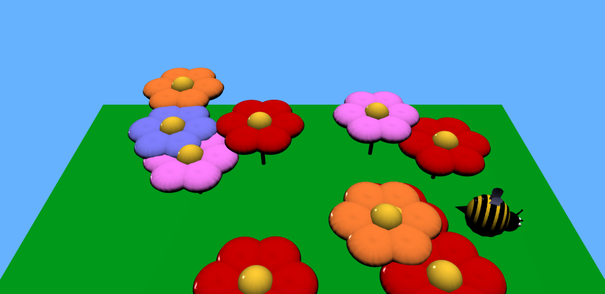

# Flight of the bumblebee

This is a project for Computer Graphics course 2019/2020.
Project was made using WebGL library and [gl-matrix-min.js](https://github.com/toji/gl-matrix/blob/master/LICENSE.md).

## Control:
To control you can use kayboard or panels on the right side of the screen.

- Switching panels:
    - [ 1 ] - camera panel
    - [ 2 ] - shading panel
    - [ 3 ] - bumblebee panel
    - [ 4 ] - weather panel
    - [ 5 ] - switch off panels
    
    Next to name of every panel in the brackets, there is a number which indicates the key to switch on corresponding panel.
    
    Similarly, next to some options, there is a letter which indicates respective key.
    
- Switching cameras:
  - [ Q ] - following camera
  
    
  
  - [ W ] - tracking camera
  
    
  
  - [ E ] - static camera
  
    
  
- Switching shading:
  - [ A ] - Phong shading
  
    

  - [ S ] - Gouraud shading
  
    
  
- Switching reflection model:
  - [ Z ] - Phong model
  - [ X ] - Blinn model
  
- Switching fog:
  - [ O ] - switch on fog
  - [ P ] - switch off fog
  
    
  
- Switching day/night:
  - [ K ] - switch off night
  - [ L ] - switch on night
  
    
  
- Moving on board:
  - [ ArrowUp ] - bumblebee moves forward
  - [ ArrowDown ] - bumblebee moves backward
  - [ ArrowRight ] - bumblebee turns right
  - [ ArrowLeft ] - bumblebee turns left
  - [ 9 ] - bumblebee goes up
  - [ 0 ] - bumblebee goes down
  
- Moving following camera
  - [ N ] - zoom in
  - [ M ] - zoom out